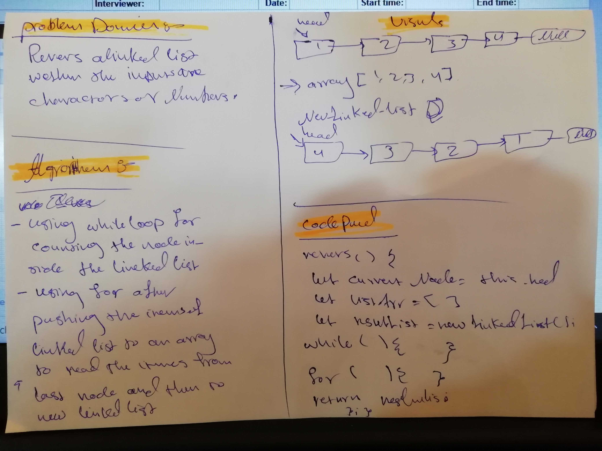

# Linked List: `reverse`
Implementation of a Linked List class method, reversing the list in place.

## Challenge Description
Reverse a Linked List. You have access to the Linked List and Node classes, as well as any methods you have written.

#### Example
    Before: 1 -> 2 -> 3 -> null
    After:  3 -> 2 -> 1 -> null

## Solution
