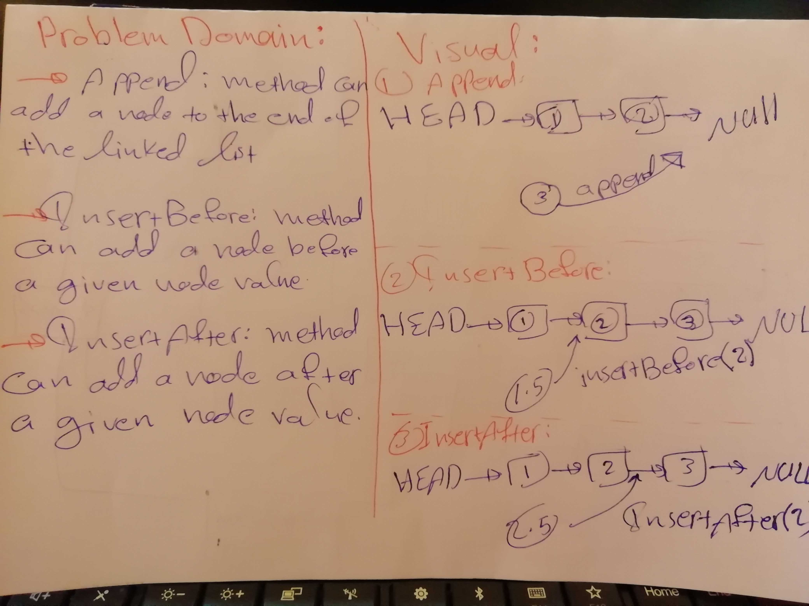

# Challenge Summary

This challenge makes you more familiar with linkedLists and how to do methods on them

## Challenge Description
The challenge asks you to create three methods on the linked list
`append()` : it adds a node to the end of the linked list.
`insertBefore()` : it adds a node to the linked list before the node of a given value.
`insertAfter()` : it adds a node to the linked list after the node of a given value.

## Approach & Efficiency
The Big O notation defines an upper bound of an algorithm, it bounds a function only from above. For example, consider the case of Insertion Sort. It takes linear time in best case and quadratic time in worst case
## Big O:
`append()`:O(1)
`insertBefore()`:O(n)
`insertAfter()`:O(n)

## Solution
